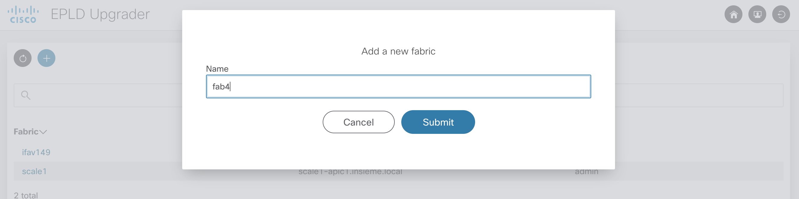
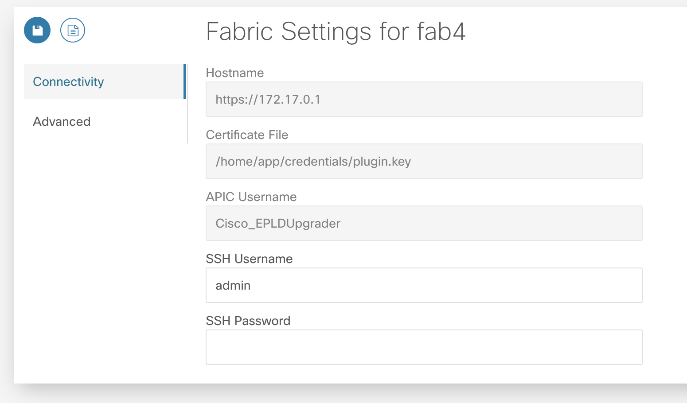
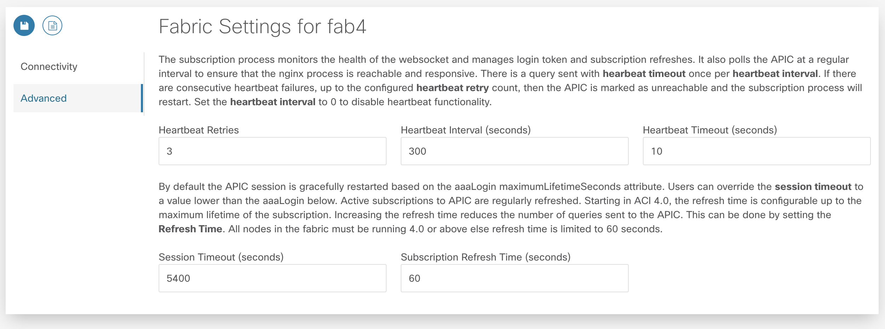

.. _usage:

Usage
=====

This section assumes EPLDUpgrader has already been installed. Please refer to the 
:ref:`install` for more details regarding installation steps. This page will cover general usage of 
the application.  Note that some sections are specific to ``standalone`` mode only.

The general usage is as follows:

* ``standalone`` under :ref:`user_accounts` update the default username and password and create 
  extra read-only users as needed.

* ``standalone`` add one or more fabrics to monitor as described under :ref:`fabrics`

* Ensure that valid ssh credentials have been configured under :ref:`settings`

* Under the :ref:`firmware` section, create an epld image from an existing nxos image currently
  present under the APIC firmware.

* Under the :ref:`devices` section, select one or more devices to upgrade. You will be prompted
  for the epld image previously created under the firmware step along with a few other upgrade
  options.

.. _user_accounts:

User Accounts
-------------

.. note:: This section is only applicable to ``standalone`` mode. In ``app`` mode the APIC handles
          all authentication and authorization requests.

Once the application is installed, the default credentials are as follows:

* **username**: admin
* **password**: cisco

You can click the Users |users-icon| icon at the top right of the page to modify credentials along 
with adding and modifying users. The app supports an **admin** role which has full read and write 
access along with a read-only **user** role.

.. _fabrics:

Fabrics
-------

.. note:: This section is only applicable to ``standalone`` mode. In ``app`` mode the fabric is auto 
          discovered when the app is installed.

Click the Home |home-icon| icon to access the home page and add fabrics to manage. Multiple fabrics 
can be managed by a single app. Simply click the Add icon and enter the fabric name. Once submitted 
you will be redirected to the :ref:`settings` page.

|standalone-add-fabric|

.. |users-icon| image:: imgs/users-icon.png
   :align: middle
   :width: 30

.. |home-icon| image:: imgs/home-icon.png
   :align: middle
   :width: 30

.. _settings:

Settings
--------

The settings section is divided into multiple sub-sections. Ensure you click the Save |save-icon| 
icon to apply your changes. 

.. |save-icon| image:: imgs/save-icon.png
   :align: middle
   :width: 30

Connectivity
^^^^^^^^^^^^

.. note:: APIC hostname and API credentials are auto detected in ``app`` mode and cannot be changed.

Connectivity settings containing hostname and APIC credentials are required to access the fabric. An 
APIC username with **admin role** on the **all** security domain is required. SSH credentials are 
required for scp operations used by this app. A user with **admin** read role is required for the 
SSH credentials. When settings are saved the credentials are checked and an error is displayed if 
the credentials are invalid.

|fabric-settings-connectivity|

Advanced
^^^^^^^^

There are a few advanced connectivity settings that can be adjusted. The default settings are 
suitable for most deployments. 

|fabric-settings-advanced|

Subscription Heartbeats
~~~~~~~~~~~~~~~~~~~~~~~

The subscription process monitors the health of the websocket and manages login token and 
subscription refreshes. It also polls the APIC at a regular interval to ensure that the nginx
process is reachable and responsive. There is a query sent with a **hearbeat timeout** once per 
**heartbeat interval**. If there are consecutive heartbeat failures, up to the configured 
**heartbeat retry** count, then the APIC is marked as unreachable and the subscription process will
restart. Set the **heartbeat interval** to 0 to disable heartbeat functionality. 

* **Heartbeat Retries** maximum number of successive heartbeat failures before APIC connection is
  declared unusable and subscription thread is closed

* **Heartbeat Interval** interval in seconds to perform heartbeat query to ensure APIC connection 
  is available and responsive. Set to 0 to disable heartbeat.

* **Heartbeat Timeout** timeout in seconds for a single heartbeat query to complete

Session Handling
~~~~~~~~~~~~~~~~

By default the APIC session is gracefully restarted based on the aaaLogin maximumLifetimeSeconds 
attribute. Users can override the session timeout to a value lower than the aaaLogin lifetime by 
setting a limit on the session time. 
Starting in ACI 4.0, the refresh time is configurable up to the maximum lifetime of the subscription. 
Increasing the refresh time reduces the number of queries sent to the APIC. This can be done by 
setting the Refresh Time. All nodes in the fabric must be running 4.0 or above else refresh time is 
limited to 60 seconds.

* **Session Timeout** maximum time in seconds before new login and websocket is started for APIC
  session
* **Subscription Refresh Time** time in seconds between subscription refreshes.

.. _firmware:

Firmware
--------

.. _devices:

Devices
-------

